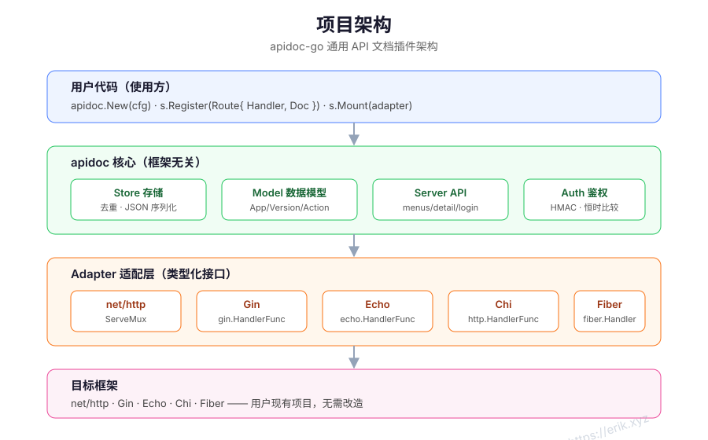
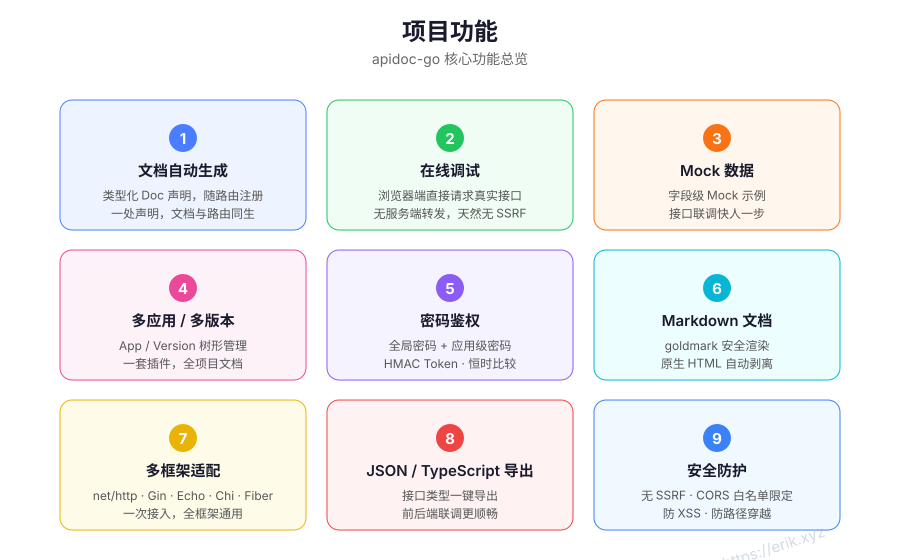
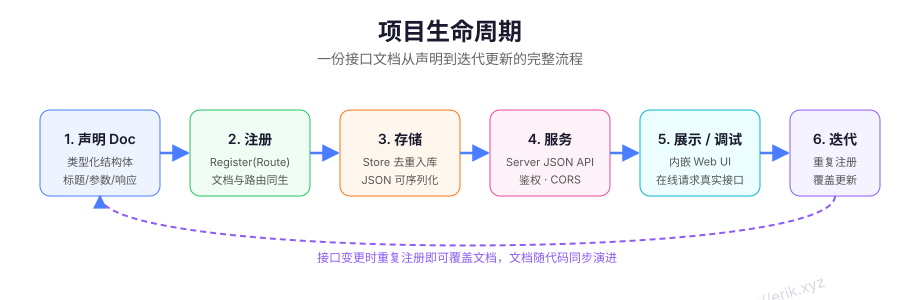

# apidoc-go — Plugin universal de documentación de API para Go

[中文](../../../README.md) · [English](../en/README.md) · [한국어](../ko/README.md) · [Русский](../ru/README.md) · [Deutsch](../de/README.md) · [Français](../fr/README.md) · [Español](../es/README.md) · [Português](../pt/README.md) · [हिन्दी](../hi/README.md) · [العربية](../ar/README.md) · [বাংলা](../bn/README.md) · [Bahasa Indonesia](../id/README.md) · [日本語](../ja/README.md)

## Descripción del proyecto

**apidoc-go** es una librería de plugin de documentación de API universal para Go: la documentación de las interfaces se declara como **structs tipados** junto con el registro de las rutas, de modo que la documentación nace al mismo tiempo que la ruta. La Web UI integrada ofrece navegación y depuración en línea, e incluye autenticación por contraseña, gestión de múltiples aplicaciones/versiones, datos Mock y exportación a JSON / TypeScript. Integra una sola vez y funcionará con todos los frameworks, sin necesidad de modificar tu proyecto existente.

## Funcionalidades

| # | Función | Descripción |
|---|---------|-------------|
| 1 | Generación automática de documentación | Declaración tipada de Doc junto con el registro de la ruta; declara una sola vez y la documentación nace junto con la ruta |
| 2 | Depuración en línea | Solicita las interfaces reales directamente desde el navegador, sin reenvío por el servidor, naturalmente sin SSRF |
| 3 | Datos Mock | Ejemplos Mock a nivel de campo, adelántate en la integración de interfaces |
| 4 | Múltiples aplicaciones / versiones | Gestión jerárquica de App / Version, un solo plugin cubre la documentación de todo el proyecto |
| 5 | Autenticación por contraseña | Contraseña global + contraseña por aplicación, HMAC Token · comparación en tiempo constante |
| 6 | Documentos Markdown | Renderizado seguro con goldmark, el HTML nativo se elimina automáticamente |
| 7 | Adaptación a múltiples frameworks | net/http · Gin · Echo · Chi · Fiber, integra una vez y funcionará con todos los frameworks |
| 8 | Exportación JSON / TypeScript | Exporta los tipos de las interfaces con un clic, integración frontend-backend más fluida |
| 9 | Protección de seguridad | Sin SSRF · CORS restringido por lista blanca · protección anti-XSS · protección contra path traversal |

## Vista general de la arquitectura







## Estructura del proyecto

```
apidoc-go/
├── apidoc.go            # Punto de entrada principal: New / Register / Mount / Handler
├── doc.go               # Tipos Route / Doc / Param / Response
├── model/               # Modelo de datos
│   └── model.go         #   Project / App / Version / Controller / Action
├── store/               # Almacenamiento y deduplicación
│   └── store.go         #   Deduplicación por (app, version, method, url); la última sobrescribe
├── auth/                # Autenticación
│   └── auth.go          #   Validación de contraseña · emisión y verificación de HMAC Token
├── server/              # API JSON + Web UI integrada
│   ├── server.go
│   └── static/
│       └── index.html
├── adapter/             # Capa de adaptación de frameworks (interfaz tipada)
│   ├── adapter.go
│   ├── nethttp.go       #   net/http  ServeMux
│   ├── gin.go           #   gin.HandlerFunc
│   ├── echo.go          #   echo.HandlerFunc
│   ├── chi.go           #   http.HandlerFunc
│   └── fiber.go         #   fiber.Handler
└── docs/                # Documentación y recursos
    ├── alipay.png
    ├── weixinpay.png
    └── svg/             # Diagramas: arquitectura / funcionalidades / ciclo de vida
```

## Guía de uso

### Instalación

```bash
go get github.com/erikwang2013/apidoc-go
```

### Inicio rápido (net/http)

```go
package main

import (
	"net/http"

	"github.com/erikwang2013/apidoc-go"
	"github.com/erikwang2013/apidoc-go/adapter"
)

func main() {
	mux := http.NewServeMux()
	s := apidoc.New(apidoc.Config{Title: "Mi documentación de API"})

	// La documentación se declara junto con la ruta
	if err := s.Register(apidoc.Route{
		Method: "GET",
		URL:    "/hello",
		Handler: http.HandlerFunc(func(w http.ResponseWriter, r *http.Request) {
			w.Write([]byte("hello"))
		}),
		Doc: apidoc.Doc{
			App:     "demo",
			Version: "v1",
			Action:  "hello",
			Title:   "Saludo",
			Params: []apidoc.Param{
				{Name: "name", Type: "string", Required: true, Desc: "Tu nombre"},
			},
		},
	}); err != nil {
		panic(err)
	}

	s.Mount(adapter.NewNetHTTP(mux))
	http.ListenAndServe(":8080", mux)
	// Visita http://localhost:8080/apidoc en el navegador
}
```

### Inicio rápido (Gin)

```go
r := gin.Default()
s := apidoc.New(apidoc.Config{Title: "Mi documentación de API"})

s.Register(apidoc.Route{
	Method:  "GET",
	URL:     "/hello",
	Handler: func(c *gin.Context) { c.String(200, "hello") },
	Doc:     apidoc.Doc{App: "demo", Version: "v1", Action: "hello", Title: "Saludo"},
})

s.Mount(adapter.NewGin(r))
r.Run(":8080")
```

Para Echo / Chi / Fiber solo hay que cambiar el constructor del adaptador: `adapter.NewEcho(e)`, `adapter.NewChi(mux)`, `adapter.NewFiber(app)`; el resto del código es idéntico.

### Opciones de configuración

| Opción | Valor por defecto | Descripción |
|--------|-------------------|-------------|
| `Prefix` | `/apidoc` | Ruta de montaje de la documentación |
| `Title` | `API Docs` | Título de la documentación |
| `Desc` | — | Descripción de la documentación |
| `GlobalParams` | — | Parámetros globales, fusionados en cada Action |
| `Auth` | — | Configuración de autenticación: `Enable` / `Password` / `Secret` / `Expire` / `Secure` |
| `Apps` | — | Configuración de aplicaciones: `Key` / `Title` / `Password` (contraseña independiente por aplicación) |
| `DebugOrigins` | — | Orígenes permitidos para depuración entre dominios (ninguno por defecto) |

### Adaptadores de frameworks

| Framework | Constructor |
|-----------|-------------|
| net/http | `adapter.NewNetHTTP(mux)` |
| Gin | `adapter.NewGin(engine)` |
| Echo | `adapter.NewEcho(e)` |
| Chi | `adapter.NewChi(mux)` |
| Fiber | `adapter.NewFiber(app)` |

## Documentación multilingüe

| Idioma | Enlace |
|--------|--------|
| English | [English](../en/README.md) |
| 한국어 | [한국어](../ko/README.md) |
| Русский | [Русский](../ru/README.md) |
| Deutsch | [Deutsch](../de/README.md) |
| Français | [Français](../fr/README.md) |
| Español | [Español](../es/README.md) |
| Português | [Português](../pt/README.md) |
| हिन्दी | [हिन्दी](../hi/README.md) |
| العربية | [العربية](../ar/README.md) |
| বাংলা | [বাংলা](../bn/README.md) |
| Bahasa Indonesia | [Bahasa Indonesia](../id/README.md) |
| 日本語 | [日本語](../ja/README.md) |

## Apóyanos

Si este proyecto te ha resultado útil, ¡no dudes en escanear los códigos QR para hacernos una propina y darnos energía para seguir manteniéndolo y actualizándolo!

<div align="center">
  
  
  <p>WeChat Pay (izquierda) · Alipay (derecha)</p>
</div>

### Donaciones por transferencia bancaria internacional

**【Datos del beneficiario】**
Nombre del beneficiario: WANG KEXUN
Número de cuenta: 881015918251

**【Banco beneficiario】**
ZA Bank
SWIFT Code: AABLHKHHXXX
Nombre del banco: ZA Bank Limited
Código bancario: 387
Dirección del banco: Core F, Cyberport 3, 100 Cyberport Road, Hong Kong

**【Banco corresponsal para remesas transfronterizas (si es necesario)】**

Ten en cuenta que esta es la información del banco corresponsal (intermediario) para remesas transfronterizas, no la del banco beneficiario. Consulta con tu banco emisor si necesita que le proporciones los datos del banco corresponsal.

Para remesas en dólares de Hong Kong, renminbi y dólares estadounidenses, el banco corresponsal es Citibank —

Nombre del banco: Citibank N.A. Hong Kong
SWIFT Code: CITIHKHXXXX
Código bancario: 006
Nombre de la sucursal: Hong Kong Branch
Código de sucursal: 391
Dirección del banco: Citibank Tower, Citibank Plaza, 3 Garden Road, Central, Hong Kong

Para remesas en otras divisas, el banco corresponsal es BNY Mellon —

Nombre del banco: THE BANK OF NEW YORK MELLON
SWIFT Code: IRVTUS3NXXX
Dirección del banco: THE BANK OF NEW YORK MELLON, 240 GREENWICH STREET, NEW YORK, United States

---

<div align="center">Made with ❤️ by <a href="https://erik.xyz">erik.xyz</a></div>
